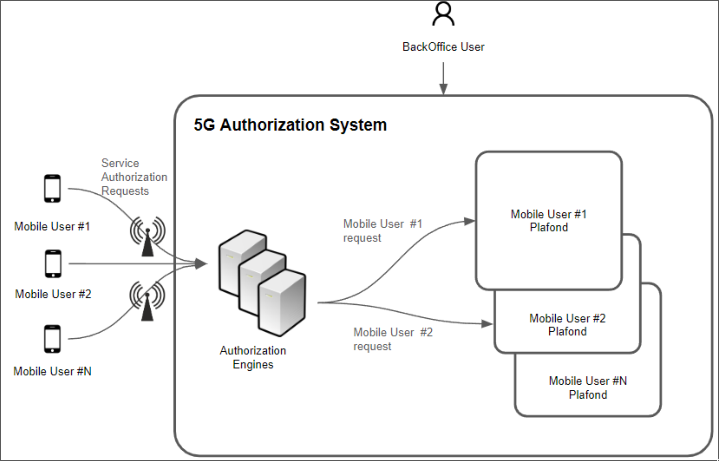
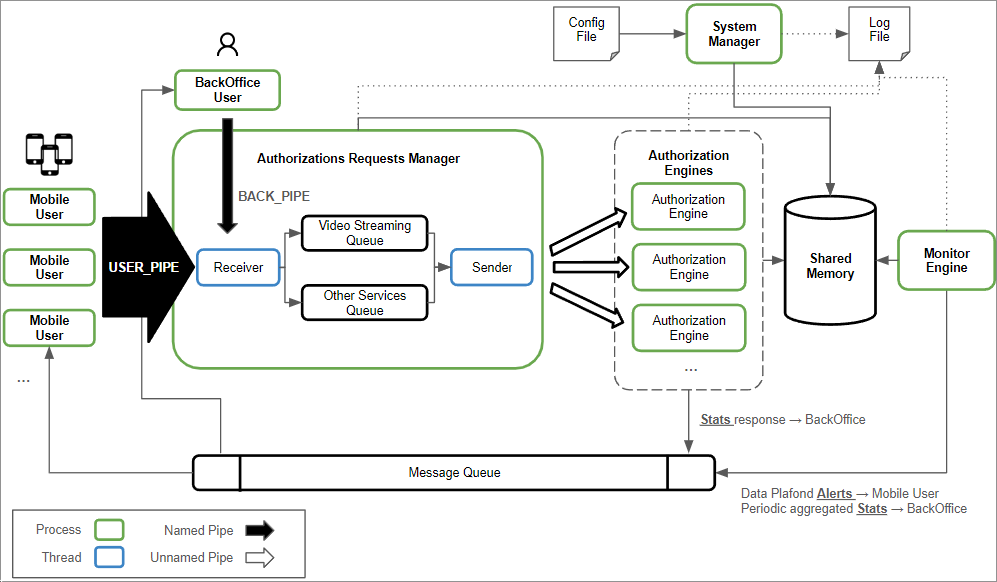
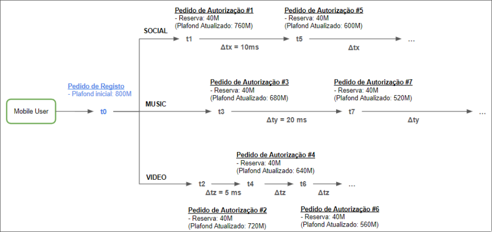

# SSASM-5G

Simulador de Sistema de Autorização de Serviços Móveis 5G

## Introdução

A elevada velocidade e baixa latência fornecida pelas sucessivas gerações da rede móvel, nomeadamente o 4G e mais recentemente o 5G, tem motivado o consumo exponencial de serviços móveis pelos utilizadores na última década. Os serviços de dados (p. ex., redes sociais, streaming vídeo, streaming música, etc.) têm hoje uma enorme utilização. Os operadores de telecomunicações, para além de garantirem o fornecimento destes serviços com qualidade, têm também que autorizar a utilização dos mesmos em tempo-real de acordo com o plafond de cada cliente. Um operador de telecomunicações faz este controlo através de plataformas de autorização em tempo-real (authorization engines), com elevada disponibilidade para responder a milhares de pedidos de serviço em simultâneo, garantindo assim que os utilizadores não têm que esperar para aceder aos serviços. Se a resposta a um pedido de serviço ultrapassar algumas centenas de milissegundos, o serviço não se inicia, o que contribui para a insatisfação do cliente.



Neste projeto simula-se um sistema de autorização em tempo real onde vários utilizadores móveis tentam utilizar vários serviços de dados em simultâneo, conforme apresentado na Figura 1. O sistema deve receber os pedidos de utilização de serviço e autorizar os mesmos de acordo com o plafond disponível de cada cliente. Para além do processo de autorização, devem também ser geradas estatísticas agregadas de utilização, bem como alertas de consumo do plafond para os utilizadores.

## Descrição do sistema de simulação

### Estrutura do Sistema



O sistema é baseado nos seguintes processos e threads:

- `Mobile User` - Processo que simula o utilizador móvel e gera pedidos de serviço de dados (redes sociais, vídeo ou música) utilizando um named pipe comum (USER_PIPE) para comunicar com o Authorization Requests Manager. É também responsável pela receção de alertas relacionados com os consumos dos vários serviços (via Message Queue). Podem existir vários destes processos.
- `BackOffice User` - Processo que gere informação agregada da utilização dos serviços pelos utilizadores. Recebe periodicamente estatísticas agregadas de utilização dos serviços (via Message Queue), ou pode também solicitar estatísticas de forma assíncrona ao Authorization Requests Manager utilizando um named pipe (BACK_PIPE). Existe, no máximo, apenas um destes processos.
- `System Manager` - Processo responsável por iniciar o sistema, ler o ficheiro de configuração, criar a Shared Memory, criar a Message Queue, e criar os processos `Authorization Requests Manager` e Monitor Engine`.
- `Authorization Requests Manager` - Processo responsável por gerir a receção de pedidos do `Mobile User` e do `BackOffice User`, encaminhar os mesmos para a respetiva fila interna (Video Streaming Queue, Other Services Queue) e a sua distribuição pelos processos Authorization Engine de acordo com as prioridades definidas. Responsável pela criação dos processos Authorization Engine, de acordo com a taxa de ocupação das filas. É também responsável pela criação dos named pipes.
- `Authorization Engine` - Processo responsável por executar pedidos de autorização de serviço. Sempre que recebe um pedido de autorização de serviço, deve verificar se o utilizador tem plafond disponível para prosseguir com o mesmo e fazer a sua contabilização na Shared Memory. É também responsável por responder à solicitação de estatísticas do BackOffice User. Podem existir vários destes processos.
- `Monitor Engine` - Processo responsável por gerar alertas se os valores dos consumos de cada utilizador atingem os limites definidos pelo sistema (80%, 90%, 100%). Se for este o caso, então deve alertar os mesmos através da Message Queue. É também responsável por enviar as estatísticas periódicas agregadas para o BackOffice User.
- `Receiver` - Thread que lê os comandos do Mobile User e do BackOffice User enviados através dos named pipes.
- `Sender` - Thread que lê os pedidos que estão armazenados nas filas (Video Streaming Queue, Other Services Queue) e envia os mesmos através de unnamed pipes para um Authorization Engine que esteja disponível. Os pedidos de autorização na fila Video Streaming Queue têm prioridade sobre os pedidos na fila Other Services Queue

Para além dos processos e threads descritos acima, o sistema é também constituído por vários IPCs:

- `Named Pipe` - Permite que os Mobile Users (USER_PIPE) e o BackOffice User (BACK_PIPE) enviem dados ao processo Authorization Requests Manager.
- `SHM` - Zona de memória partilhada acedida pelos processos System Manager, Authorization Engine, Authorization Request Manager e Monitor Engine.
- `Unnamed pipes` - Permitem a comunicação entre o processo Authorization Requests Manager e cada um dos processos Authorization Engine.
- `Message Queue` (fila de mensagens) - Permite o envio (pelo Authorization Engine) da resposta aos pedidos de autorização dos Mobile Users, bem como o envio de estatísticas agregadas solicitadas pelo BackOffice User. Permite também o envio de alertas a partir do Monitor Engine para os Mobile Users.

Dentro do processo Authorization Requests Manager existem duas estruturas de
dados de tamanho fixo que armazenam os dados e comandos que têm de ser
processados pelos Authorization Engines:

1. `Video Streaming Queue`: fila que armazena pedidos de autorização do serviço de vídeo streaming enviados pelos Mobile Users;
2. `Other Services Queue`: fila que armazena todos os outros pedidos de autorização de serviço enviados pelos Mobile Users e os comandos enviados pelo BackOffice User;

Existirá também um ficheiro de log onde todos os processos escrevem as informações relevantes sobre a sua atividade para análise posterior. Todas as informações escritas para o log também aparecem no ecrã.

### Descrição dos componentes e funcionalidades

De seguida são apresentadas as características e funcionalidades dos diversos componentes.

#### Mobile User

Processo que gera pedidos de autorização para cada um dos 3 serviços do simulador (streaming de vídeo, streaming de música e redes sociais). O Mobile User gera duas mensagens:

1. `Registo inicial`: mensagem inicial para simular o registo do Mobile User na plataforma de autorizações de serviço. Neste pedido terá que ser indicado o plafond inicial do Mobile User. Este valor é registado na Shared Memory.
2. `Pedido de autorização`: mensagem para simular os pedidos de autorização de serviço do Mobile User. Estas mensagens são enviadas em intervalos periódicos (Δt), específicos para cada tipo de serviço. Para cada pedido de autorização é indicada a quantidade de dados a reservar do plafond disponível. Este passo repete-se até o número máximo de pedidos de autorização estar concluído ou o plafond esgotado.



O plafond inicial, o número de pedidos de autorização a enviar, os intervalos periódicos de renovação (Δt) por serviço e a quantidade de dados a reservar em cada pedido de renovação é fornecido através da linha de comandos no arranque do Mobile User. Cada um dos processos Mobile User envia as mensagens através do named pipe USER_PIPE. Podemos ter um ou mais processos destes a correr em simultâneo, cada um com os seus parâmetros.

Sintaxe do comando de inicialização do processo Mobile User:

```sh
$ mobile_user /
{plafond inicial} /
{número de pedidos de autorização} /
{intervalo VIDEO} {intervalo MUSIC} {intervalo SOCIAL} /
{dados a reservar}
```

exemplo:

```sh
$ mobile_user 800 50 10 20 5 40
```
